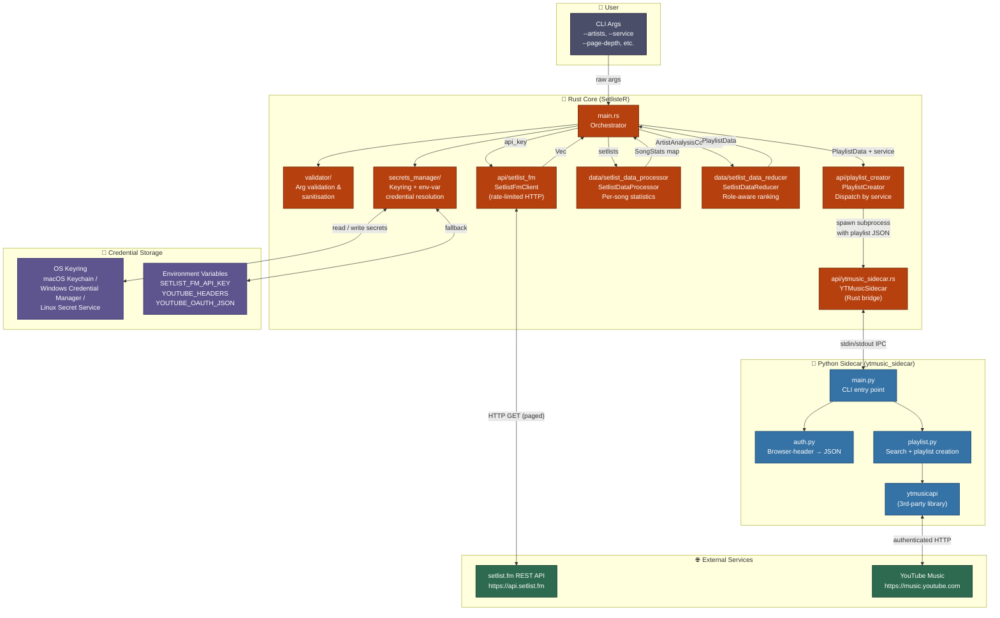

# SetlisteR — System Architecture

High-level overview of the SetlisteR system: how the Rust CLI, the external setlist.fm API, and the Python YouTube Music sidecar relate to each other.

```mermaid
graph TB
    subgraph User["👤 User"]
        CLI["CLI Args\n--artists, --service\n--page-depth, etc."]
    end

    subgraph Core["🦀 Rust Core (SetlisteR)"]
        direction TB
        MAIN["main.rs\nOrchestrator"]
        VALIDATOR["validator/\nArg validation &\nsanitisation"]
        SM["secrets_manager/\nKeyring + env-var\ncredential resolution"]
        API_SETLIST["api/setlist_fm\nSetlistFmClient\n(rate-limited HTTP)"]
        PROC["data/setlist_data_processor\nSetlistDataProcessor\nPer-song statistics"]
        REDUCER["data/setlist_data_reducer\nSetlistDataReducer\nRole-aware ranking"]
        CREATOR["api/playlist_creator\nPlaylistCreator\nDispatch by service"]
        YTRUST["api/ytmusic_sidecar.rs\nYTMusicSidecar\n(Rust bridge)"]
    end

    subgraph Sidecar["🐍 Python Sidecar (ytmusic_sidecar)"]
        direction TB
        PYMAIN["main.py\nCLI entry point"]
        PYAUTH["auth.py\nBrowser-header → JSON"]
        PYPLAY["playlist.py\nSearch + playlist creation"]
        YTAPI["ytmusicapi\n(3rd-party library)"]
    end

    subgraph External["🌐 External Services"]
        SETLIST_API["setlist.fm REST API\nhttps://api.setlist.fm"]
        YTMUSIC["YouTube Music\nhttps://music.youtube.com"]
    end

    subgraph Storage["🔐 Credential Storage"]
        KEYRING["OS Keyring\nmacOS Keychain /\nWindows Credential Manager /\nLinux Secret Service"]
        ENV["Environment Variables\nSETLIST_FM_API_KEY\nYOUTUBE_HEADERS\nYOUTUBE_OAUTH_JSON"]
    end

    CLI -->|"raw args"| MAIN
    MAIN --> VALIDATOR
    MAIN --> SM
    SM <-->|"read / write secrets"| KEYRING
    SM <-->|"fallback"| ENV
    MAIN -->|"api_key"| API_SETLIST
    API_SETLIST <-->|"HTTP GET (paged)"| SETLIST_API
    API_SETLIST -->|"Vec<SetlistResponse>"| MAIN
    MAIN -->|"setlists"| PROC
    PROC -->|"SongStats map"| MAIN
    MAIN -->|"ArtistAnalysisCollection"| REDUCER
    REDUCER -->|"PlaylistData"| MAIN
    MAIN -->|"PlaylistData + service"| CREATOR
    CREATOR -->|"spawn subprocess\nwith playlist JSON"| YTRUST
    YTRUST <-->|"stdin/stdout IPC"| PYMAIN
    PYMAIN --> PYAUTH
    PYMAIN --> PYPLAY
    PYPLAY --> YTAPI
    YTAPI <-->|"authenticated HTTP"| YTMUSIC

    classDef rustNode fill:#b7410e,color:#fff,stroke:#7a2b07,stroke-width:1.5px
    classDef pyNode fill:#3572A5,color:#fff,stroke:#1e4d77,stroke-width:1.5px
    classDef extNode fill:#2d6a4f,color:#fff,stroke:#1b4332,stroke-width:1.5px
    classDef storeNode fill:#5e548e,color:#fff,stroke:#3d3773,stroke-width:1.5px
    classDef userNode fill:#4a4e69,color:#fff,stroke:#22223b,stroke-width:1.5px

    class MAIN,VALIDATOR,SM,API_SETLIST,PROC,REDUCER,CREATOR,YTRUST rustNode
    class PYMAIN,PYAUTH,PYPLAY,YTAPI pyNode
    class SETLIST_API,YTMUSIC extNode
    class KEYRING,ENV storeNode
    class CLI userNode
```
