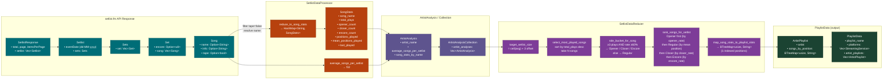

# SetlisteR — Data Pipeline & Models

How raw setlist.fm API responses are transformed into a ranked, role-aware playlist.

```mermaid
flowchart LR
    subgraph API_RESP["setlist.fm API Response"]
        SR["SetlistResponse\n• total, page, itemsPerPage\n• setlist: Vec&lt;Setlist&gt;"]
        SL["Setlist\n• eventDate (dd-MM-yyyy)\n• sets: Sets"]
        SETS["Sets\n• set: Vec&lt;Set&gt;"]
        SET["Set\n• encore: Option&lt;u8&gt;\n• song: Vec&lt;Song&gt;"]
        SONG["Song\n• name: Option&lt;String&gt;\n• info: Option&lt;String&gt;\n• tape: Option&lt;bool&gt;"]
    end

    SR --> SL --> SETS --> SET --> SONG

    subgraph PROC["SetlistDataProcessor"]
        direction TB
        P1["reduce_to_song_stats\n→ HashMap&lt;String, SongStats&gt;"]
        P2["average_songs_per_setlist\n→ f32"]
        SS["SongStats\n• song_name\n• total_plays\n• opener_count\n• closer_count\n• encore_count\n• positions_played\n• mean_positions_played\n• last_played"]
    end

    SONG -->|"filter tape=false\nresolve name"| P1
    P1 --> SS
    SONG --> P2

    subgraph META["ArtistAnalysis / Collection"]
        AA["ArtistAnalysis\n• artist_name\n• average_songs_per_setlist\n• song_stats_by_name"]
        AAC["ArtistAnalysisCollection\n• artist_analyses: Vec&lt;ArtistAnalysis&gt;"]
    end

    SS --> AA
    P2 --> AA
    AA --> AAC

    subgraph REDUCE["SetlistDataReducer"]
        direction TB
        R1["target_setlist_size\n= ceil(avg) + 3 offset"]
        R2["select_most_played_songs\nsort by total_plays desc\ntake N songs"]
        R3["role_bucket_for_song\n≥3 plays AND rate ≥60%\n→ Opener / Closer / Encore\nelse → Regular"]
        R4["rank_songs_for_setlist\nOpener first (by opener_rate)\nthen Regular (by mean position)\nthen Closer (by closer_rate)\nthen Encore (by encore_rate)"]
        R5["map_song_stats_to_playlist_slots\n→ BTreeMap&lt;usize, String&gt;\n(1-indexed positions)"]
    end

    AAC --> R1 --> R2 --> R3 --> R4 --> R5

    subgraph PD["PlaylistData (output)"]
        PL["PlaylistData\n• playlist_name\n• platforms: Vec&lt;StreamingService&gt;\n• artist_playlists: Vec&lt;ArtistPlaylist&gt;"]
        AP["ArtistPlaylist\n• artist\n• songs_by_position: BTreeMap&lt;usize, String&gt;"]
    end

    R5 --> AP --> PL

    classDef apiStyle fill:#006d77,color:#fff,stroke:#004d56
    classDef procStyle fill:#b7410e,color:#fff,stroke:#7a2b07
    classDef metaStyle fill:#5e548e,color:#fff,stroke:#3d3773
    classDef reduceStyle fill:#7d3c98,color:#fff,stroke:#5b2c6f
    classDef outputStyle fill:#1b4332,color:#fff,stroke:#0d2b1f

    class SR,SL,SETS,SET,SONG apiStyle
    class P1,P2,SS procStyle
    class AA,AAC metaStyle
    class R1,R2,R3,R4,R5 reduceStyle
    class PL,AP outputStyle
```
