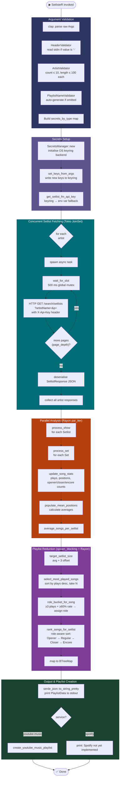

# SetlisteR — Main Execution Flow

Step-by-step walkthrough of what happens from the moment `SetlisteR` is invoked to when the playlist is created.

```mermaid
flowchart TD
    START(["▶ SetlisteR invoked"])

    subgraph Validation["Argument Validation"]
        PARSE["clap: parse raw Args"]
        VAL_HEADERS["HeaderValidator\nread stdin if value is '-'"]
        VAL_ARTISTS["ArtistValidator\ncount ≤ 10, length ≤ 100 each"]
        VAL_NAME["PlaylistNameValidator\nauto-generate if omitted"]
        BUILD_SECRETS["Build secrets_by_type map"]
    end

    subgraph SecretsSetup["Secrets Setup"]
        SM_INIT["SecretsManager::new\ninitialise OS keyring backend"]
        STORE_KEYS["set_keys_from_args\nwrite new keys to keyring"]
        GET_APIKEY["get_setlist_fm_api_key\nkeyring → env var fallback"]
    end

    subgraph Fetching["Concurrent Setlist Fetching (Tokio JoinSet)"]
        FOR_ARTIST{"for each\nartist"}
        SPAWN["spawn async task"]
        RATE["wait_for_slot\n500 ms global mutex"]
        HTTP["HTTP GET /search/setlists\n?artistName=&p=\nwith X-Api-Key header"]
        PAGE{"more pages\n(page_depth)?"}
        PARSE_RESP["deserialise SetlistResponse JSON"]
        COLLECT["collect all artist responses"]
    end

    subgraph Analysis["Parallel Analysis (Rayon par_iter)"]
        PROC_SHOW["process_show\nfor each Setlist"]
        PROC_SET["process_set\nfor each Set"]
        UPDATE_STATS["update_song_stats\nplays, positions, opener/closer/encore counts"]
        MEAN_POS["populate_mean_positions\ncalculate averages"]
        AVG_SONGS["average_songs_per_setlist"]
    end

    subgraph Reduction["Playlist Reduction (spawn_blocking + Rayon)"]
        TARGET["target_setlist_size\navg + 3 offset"]
        SELECT["select_most_played_songs\nsort by plays desc, take N"]
        RANK["rank_songs_for_setlist\nrole-aware sort:\nOpener → Regular → Closer → Encore"]
        ROLE["role_bucket_for_song\n≥3 plays + ≥60% rate → assign role"]
        MAP["map to BTreeMap<position, song_name>"]
    end

    subgraph Output["Output & Playlist Creation"]
        JSON_OUT["serde_json::to_string_pretty\nprint PlaylistData to stdout"]
        DISPATCH{"service?"}
        SPOTIFY["print: Spotify not yet implemented"]
        YT["create_youtube_music_playlist"]
    end

    START --> PARSE
    PARSE --> VAL_HEADERS --> VAL_ARTISTS --> VAL_NAME --> BUILD_SECRETS
    BUILD_SECRETS --> SM_INIT
    SM_INIT --> STORE_KEYS --> GET_APIKEY
    GET_APIKEY --> FOR_ARTIST
    FOR_ARTIST --> SPAWN
    SPAWN --> RATE --> HTTP --> PAGE
    PAGE -- yes --> RATE
    PAGE -- no --> PARSE_RESP --> COLLECT
    COLLECT --> PROC_SHOW
    PROC_SHOW --> PROC_SET --> UPDATE_STATS --> MEAN_POS
    MEAN_POS --> AVG_SONGS
    AVG_SONGS --> TARGET
    TARGET --> SELECT --> ROLE --> RANK --> MAP
    MAP --> JSON_OUT
    JSON_OUT --> DISPATCH
    DISPATCH -- spotify --> SPOTIFY
    DISPATCH -- youtube-music --> YT
    YT --> DONE(["✅ Done"])
    SPOTIFY --> DONE

    style Validation fill:#2d3561,color:#fff,stroke:#1a2040
    style SecretsSetup fill:#5e548e,color:#fff,stroke:#3d3773
    style Fetching fill:#006d77,color:#fff,stroke:#004d56
    style Analysis fill:#b7410e,color:#fff,stroke:#7a2b07
    style Reduction fill:#7d3c98,color:#fff,stroke:#5b2c6f
    style Output fill:#1b4332,color:#fff,stroke:#0d2b1f
```
