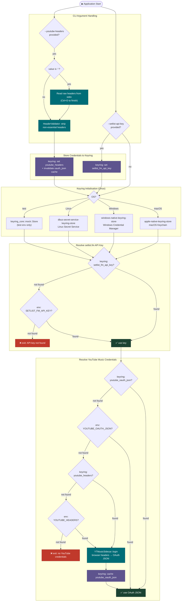

# SetlisteR — Credential Resolution Flow

How SetlisteR stores, retrieves, and falls back for all three credential types.

```mermaid
flowchart TD
    START(["▶ Application Start"])

    subgraph ArgParsing["CLI Argument Handling"]
        API_ARG{"--setlist-api-key\nprovided?"}
        YT_ARG{"--youtube-headers\nprovided?"}
        STDIN{"value is '-'?"}
        READ_STDIN["Read raw headers from stdin\n(Ctrl+D to finish)"]
        SANITIZE["HeaderValidator: strip\nnon-essential headers"]
    end

    subgraph KeyringInit["Keyring Initialisation (Once)"]
        OS{"OS?"}
        MAC["apple-native-keyring-store\nmacOS Keychain"]
        WIN["windows-native-keyring-store\nWindows Credential Manager"]
        LIN["dbus-secret-service-keyring-store\nLinux Secret Service"]
        TEST["keyring_core::mock::Store\n(test env only)"]
    end

    subgraph StoreKeys["Store Credentials to Keyring"]
        STORE_API["keyring: set setlist_fm_api_key"]
        STORE_YT["keyring: set youtube_headers\n+ invalidate oauth_json cache"]
    end

    subgraph ResolveSFM["Resolve setlist.fm API Key"]
        KR_SFM{"keyring:\nsetlist_fm_api_key?"}
        ENV_SFM{"env:\nSETLIST_FM_API_KEY?"}
        FAIL_SFM["❌ exit: API key not found"]
        OK_SFM["✅ use key"]
    end

    subgraph ResolveYT["Resolve YouTube Music Credentials"]
        KR_OAUTH{"keyring:\nyoutube_oauth_json?"}
        ENV_OAUTH{"env:\nYOUTUBE_OAUTH_JSON?"}
        KR_HDR{"keyring:\nyoutube_headers?"}
        ENV_HDR{"env:\nYOUTUBE_HEADERS?"}
        FAIL_YT["❌ exit: no YouTube credentials"]
        LOGIN["YTMusicSidecar::login\nbrowser headers → OAuth JSON"]
        STORE_OAUTH["keyring: cache youtube_oauth_json"]
        USE_OAUTH["✅ use OAuth JSON"]
    end

    START --> API_ARG
    API_ARG -- yes --> STORE_API
    API_ARG -- no --> OS
    YT_ARG -- yes --> STDIN
    STDIN -- yes --> READ_STDIN --> SANITIZE --> STORE_YT
    STDIN -- no --> SANITIZE
    STORE_API --> OS
    STORE_YT --> OS

    OS -- macOS --> MAC --> KR_SFM
    OS -- Windows --> WIN --> KR_SFM
    OS -- Linux --> LIN --> KR_SFM
    OS -- test --> TEST --> KR_SFM

    START --> YT_ARG

    KR_SFM -- found --> OK_SFM
    KR_SFM -- not found --> ENV_SFM
    ENV_SFM -- found --> OK_SFM
    ENV_SFM -- not found --> FAIL_SFM

    OK_SFM --> KR_OAUTH
    KR_OAUTH -- found --> USE_OAUTH
    KR_OAUTH -- not found --> ENV_OAUTH
    ENV_OAUTH -- found --> USE_OAUTH
    ENV_OAUTH -- not found --> KR_HDR
    KR_HDR -- found --> LOGIN
    KR_HDR -- not found --> ENV_HDR
    ENV_HDR -- found --> LOGIN
    ENV_HDR -- not found --> FAIL_YT
    LOGIN --> STORE_OAUTH --> USE_OAUTH

    classDef failNode fill:#c0392b,color:#fff,stroke:#922b21
    classDef okNode fill:#1b4332,color:#fff,stroke:#0d2b1f
    classDef storeNode fill:#5e548e,color:#fff,stroke:#3d3773
    classDef ioNode fill:#006d77,color:#fff,stroke:#004d56

    class FAIL_SFM,FAIL_YT failNode
    class OK_SFM,USE_OAUTH okNode
    class STORE_API,STORE_YT,STORE_OAUTH storeNode
    class READ_STDIN,SANITIZE,LOGIN ioNode
```
