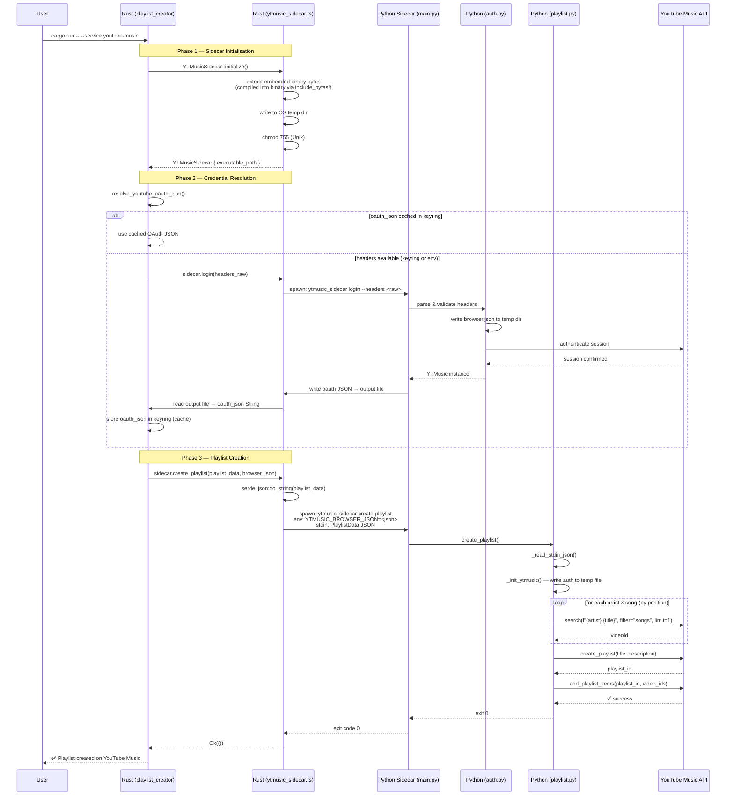

# SetlisteR — YouTube Music Sidecar Flow

How the Rust binary communicates with the bundled Python sidecar to create a YouTube Music playlist.

```mermaid
sequenceDiagram
    participant User
    participant Rust as Rust (playlist_creator)
    participant Bridge as Rust (ytmusic_sidecar.rs)
    participant Sidecar as Python Sidecar (main.py)
    participant Auth as Python (auth.py)
    participant Play as Python (playlist.py)
    participant YT as YouTube Music API

    User->>Rust: cargo run -- --service youtube-music

    Note over Rust,Bridge: Phase 1 — Sidecar Initialisation
    Rust->>Bridge: YTMusicSidecar::initialize()
    Bridge->>Bridge: extract embedded binary bytes<br/>(compiled into binary via include_bytes!)
    Bridge->>Bridge: write to OS temp dir
    Bridge->>Bridge: chmod 755 (Unix)
    Bridge-->>Rust: YTMusicSidecar { executable_path }

    Note over Rust,Bridge: Phase 2 — Credential Resolution
    Rust->>Rust: resolve_youtube_oauth_json()
    alt oauth_json cached in keyring
        Rust-->>Rust: use cached OAuth JSON
    else headers available (keyring or env)
        Rust->>Bridge: sidecar.login(headers_raw)
        Bridge->>Sidecar: spawn: ytmusic_sidecar login --headers <raw>
        Sidecar->>Auth: parse & validate headers
        Auth->>Auth: write browser.json to temp dir
        Auth->>YT: authenticate session
        YT-->>Auth: session confirmed
        Auth-->>Sidecar: YTMusic instance
        Sidecar->>Bridge: write oauth JSON → output file
        Bridge->>Rust: read output file → oauth_json String
        Rust->>Rust: store oauth_json in keyring (cache)
    end

    Note over Rust,Bridge: Phase 3 — Playlist Creation
    Rust->>Bridge: sidecar.create_playlist(playlist_data, browser_json)
    Bridge->>Bridge: serde_json::to_string(playlist_data)
    Bridge->>Sidecar: spawn: ytmusic_sidecar create-playlist<br/>env: YTMUSIC_BROWSER_JSON=<json><br/>stdin: PlaylistData JSON
    Sidecar->>Play: create_playlist()
    Play->>Play: _read_stdin_json()
    Play->>Play: _init_ytmusic() — write auth to temp file
    loop for each artist × song (by position)
        Play->>YT: search(f"{artist} {title}", filter="songs", limit=1)
        YT-->>Play: videoId
    end
    Play->>YT: create_playlist(title, description)
    YT-->>Play: playlist_id
    Play->>YT: add_playlist_items(playlist_id, video_ids)
    YT-->>Play: ✅ success
    Play-->>Sidecar: exit 0
    Sidecar-->>Bridge: exit code 0
    Bridge-->>Rust: Ok(())
    Rust-->>User: ✅ Playlist created on YouTube Music
```
